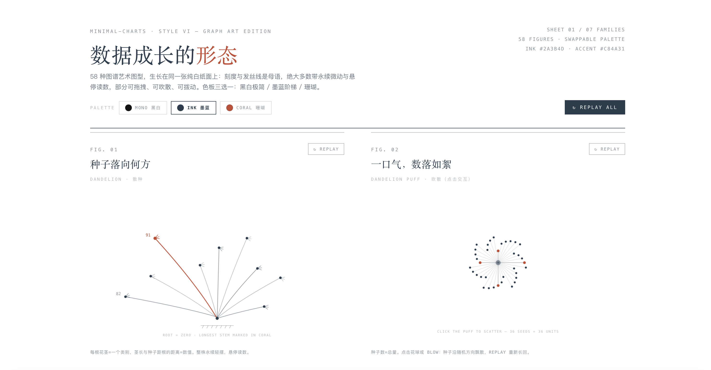
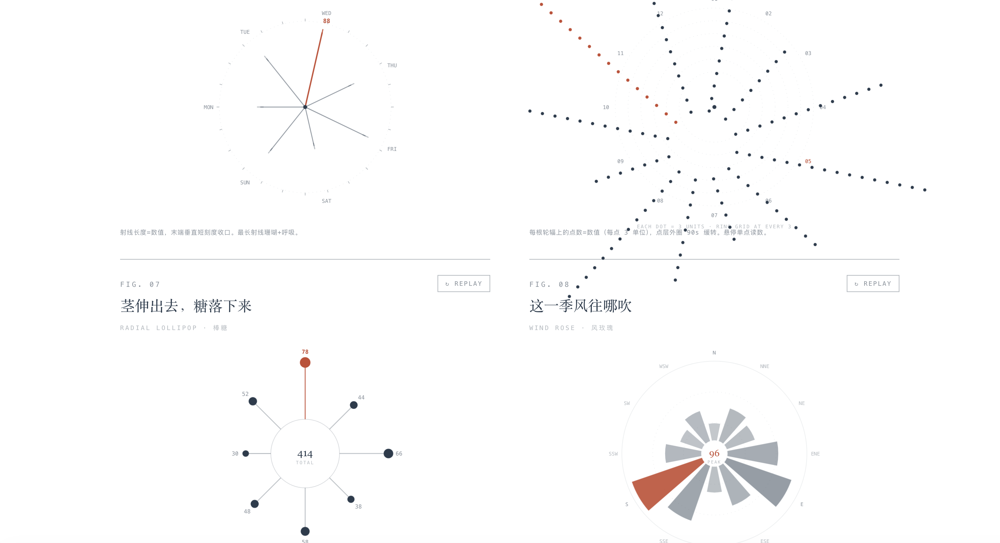
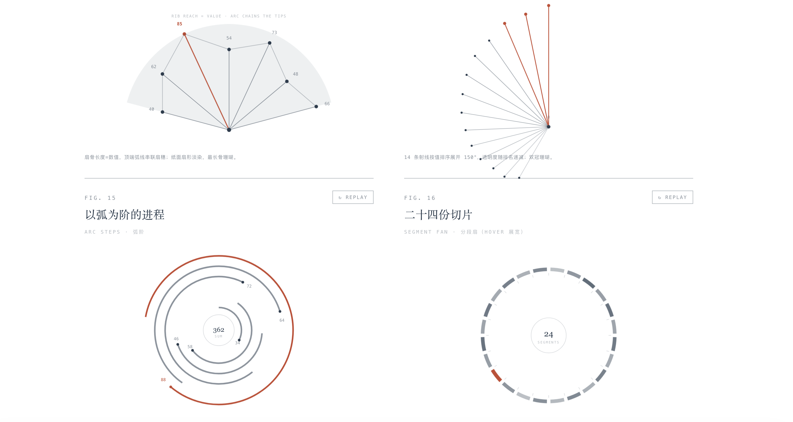
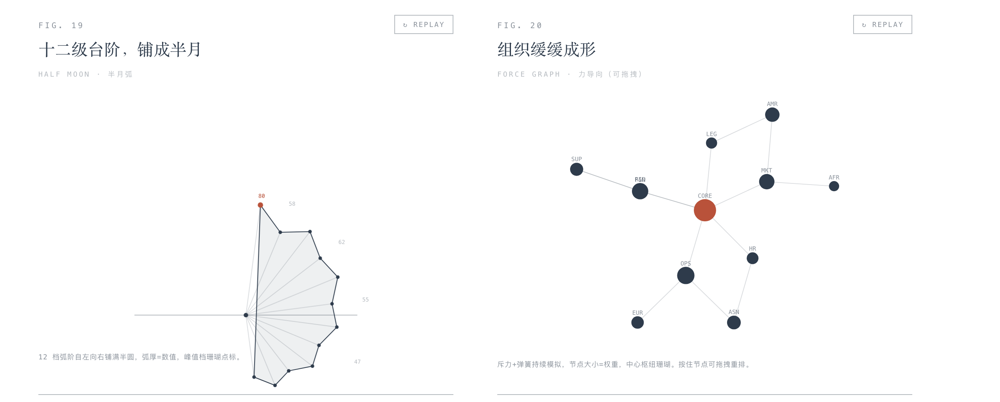
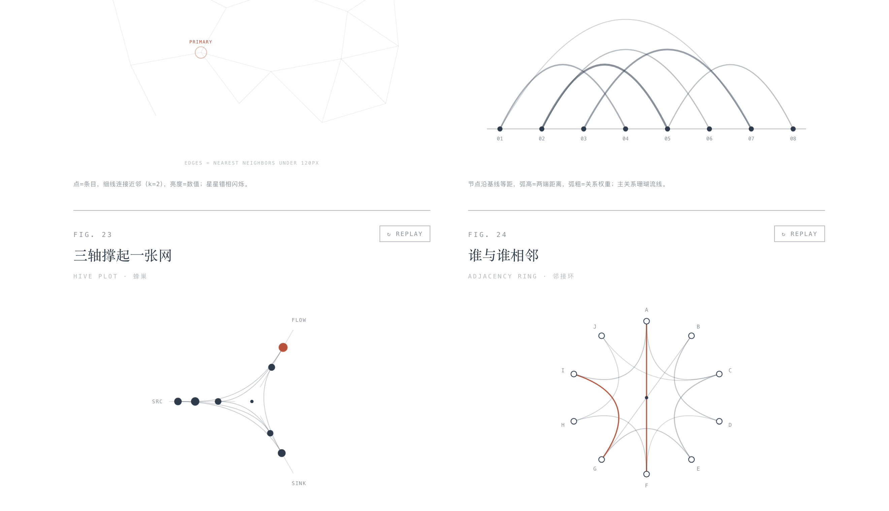
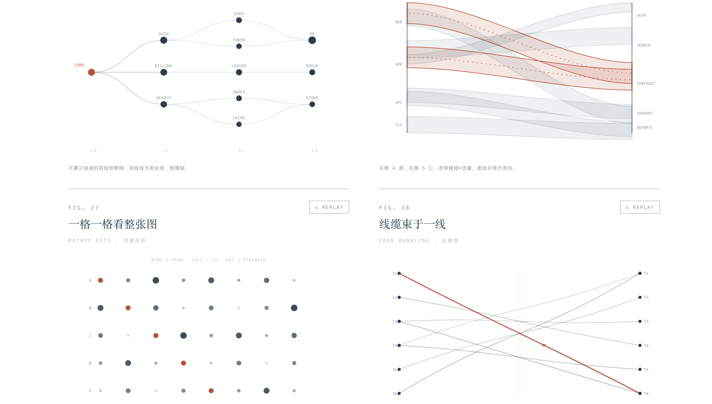
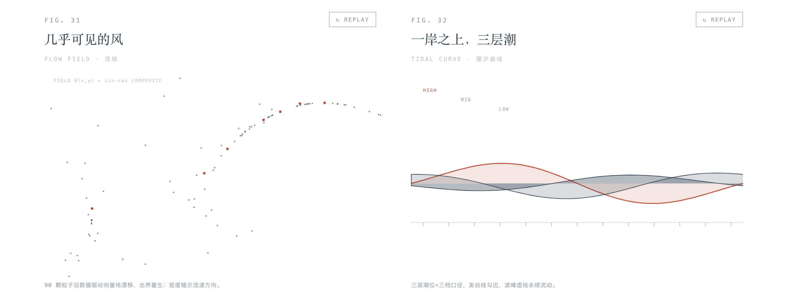
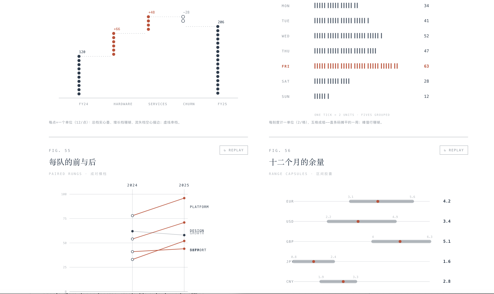

# Editorial Graph Gallery · 图谱艺术图表集

**58 种编辑式图谱艺术图型，面向 AI Agent 的可交互 HTML 数据可视化技能。**

A gallery of 58 editorial-style graph art figures — an interactive HTML data-visualization skill designed for AI agents. Zero dependencies, single-file output, works offline.

---

## ✨ 特性 / Features

- **58 种图型 / 7 大族** — 蒲公英放射（12）· 开扇弧形（7）· 关系网络（10）· 流动轨迹（8）· 时间序列（7）· 分布对比（8）· 编辑经典（6）
- **编辑式美学** — 纯白纸面 · 墨蓝 `#2A3B4D` 透明度阶梯 · 珊瑚 `#C84A31` 单强调 · 衬线图题 + 等宽角标，如杂志数据专栏
- **三套主题** — MONO 黑白极简 / INK 墨蓝阶梯 / CORAL 珊瑚强调，一键切换全页重绘
- **动态 × 交互** — 入场生长、永续呼吸（sway/bob/flow/breathe）、hover tooltip、REPLAY 重播、力导向拖拽、点击吹散、琴弦拨动
- **零依赖单文件** — 纯 SVG + 原生 JS，无 CDN、无字体加载、无构建，双击即开
- **可访问性** — `prefers-reduced-motion` 自动降级为静态定格
- **Agent 友好** — fig() 数据契约 + 拆页公式，任意结构化数据 → 定制图表页

## 🚀 快速开始 / Quick Start

**人类用法**：直接用浏览器打开 [`assets/editorial-graph-gallery.html`](assets/editorial-graph-gallery.html)，翻阅 58 个图型，右上角切换主题。

**AI Agent 用法**：本仓库即一个 Skill。把仓库放进 agent 的 skills 目录，Agent 读取 `SKILL.md` 后即可按以下路径工作：

```
选图型(references/figure-catalog.md)
→ 读规范(references/design-system.md)
→ 拆页组装(references/agent-guide.md 的拆页公式)
→ 真实数据写进 fig().draw()
→ 质检(node --check + 桩 DOM 冒烟 + 三主题预览)
→ 交付单文件 HTML
```

真实数据范例见 [`examples/sku-dashboard-jul2026.html`](examples/sku-dashboard-jul2026.html)（66 行销售明细 → 弦环 / 径向棒糖等三图定制页）。

## 🗂 图型速览 / Figure Families

| 族 | 图型举例 | 适用数据 |
|---|---|---|
| A 蒲公英放射 | 弦环 · 旭日开扇 · 风玫瑰 · 星域 | 层级、构成、周期指标 |
| B 开扇弧形 | 折扇肋 · 分段扇 · 双弧镜像 | 有序比较、两期对比 |
| C 关系网络 | 力导向 · 星座连线 · 蜂巢 · 边捆绑 | 网状关系、依赖、流量 |
| D 流动轨迹 | 流场 · 粒子溪流 · 河曲流带 | 连续流向、矢量场 |
| E 时间序列 | 螺旋时间 · 日历点阵 · 相位钟 | 周期与事件时序 |
| F 分布对比 | 山脊线 · 蜂群漂移 · 凹凸竞速 | 分布、排名变化 |
| G 编辑经典 | 点阵瀑布 · 区间胶囊 · 年轮环 | 年报级小图 |

完整 58 型名录（中文图名 + 英文类型 + 交互说明 + 选型速查）见 [`references/figure-catalog.md`](references/figure-catalog.md)。

## 🖼 画廊预览 / Gallery Preview

<table>
  <tr>
    <td width="50%"></td>
    <td width="50%"></td>
  </tr>
  <tr>
    <td></td>
    <td></td>
  </tr>
  <tr>
    <td></td>
    <td></td>
  </tr>
  <tr>
    <td></td>
    <td></td>
  </tr>
</table>

## 📁 仓库结构 / Structure

```
├── SKILL.md                          # Agent 技能定义（入口）
├── assets/
│   └── editorial-graph-gallery.html  # 画廊本体 · 58 型模板源
├── screenshots/                      # README 画廊预览图
├── references/
│   ├── figure-catalog.md             # 58 型总目 + 选型速查
│   ├── design-system.md              # 设计规范（纸面/三主题/动效三档）
│   └── agent-guide.md                # 拆页公式 + 质检流程
└── examples/
    └── sku-dashboard-jul2026.html    # 真实数据实战范例
```

## 📄 License

[MIT](LICENSE) © 2026 ranye
